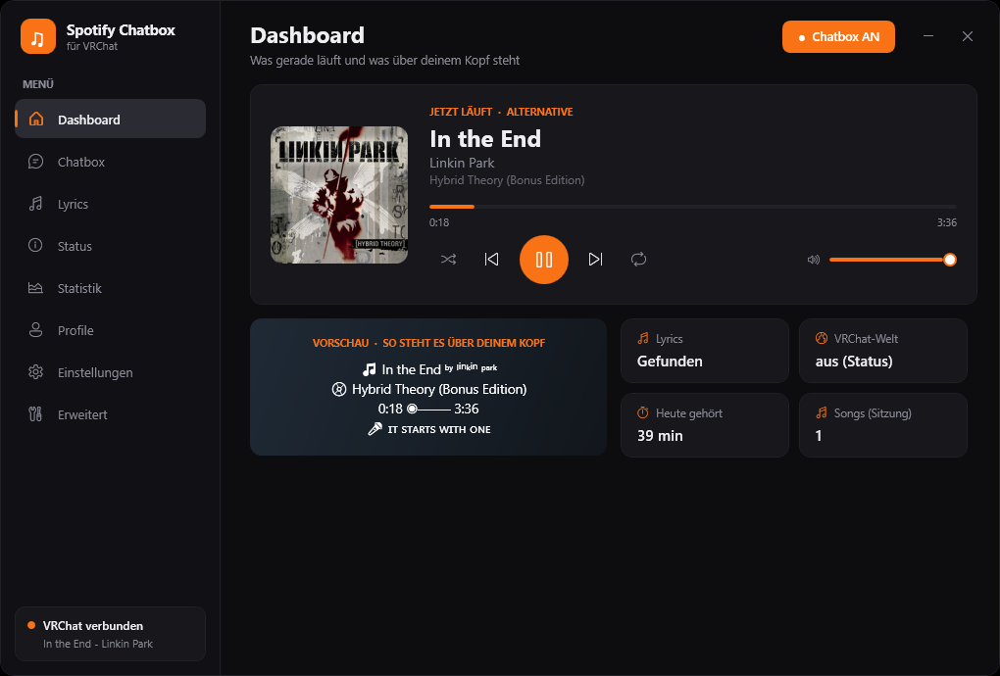

# 🎵 Spotify Chatbox for VRChat

**Show the song you're listening to on Spotify above your head in VRChat. With live lyrics, a progress bar, and no dark chatbox background.**

**🇩🇪 [Deutsche Version weiter unten](#-deutsch)**



```
🎵 In the End ᵇʸ ˡⁱⁿᵏⁱⁿ ᵖᵃʳᵏ
0:18 ━◉──── 3:36
🎤 It starts with one
```

## ✨ Features

**Chatbox**
- Current song, album and progress bar (5 styles), updated live
- **No background:** the text floats in the air without the dark chatbox box
- Compact mode, small caps, superscript artist name, genre emoji, scrolling text for long titles
- Automatically hidden while you're talking (detects your microphone)
- Lines are prioritized: if the 144-character limit is reached, less important lines are dropped first, and lyrics are never cut off

**Lyrics**
- Live lyrics synced to the music, sent the moment each line is sung
- Karaoke mode: current line plus a preview of the next one
- Automatic translation into 8 languages
- Chorus-only mode, adjustable timing offset, custom lyrics for songs that have none

**Status line**
- Time, date, countdown (e.g. `⏳ gn8 in 1:20 h`)
- VRChat play time, current world and player count, in-game or desktop
- Weather, CPU / RAM / GPU usage
- AFK and auto-AFK, custom texts that rotate every 10 seconds

**Panel**
- Modern dark or light panel with 8 accent colors
- Album cover, play/pause/skip, shuffle, repeat, click-to-seek, Spotify volume
- Mini player that stays on top
- Statistics: top songs, top artists, listening time
- Profiles (e.g. "Chill", "Party") with a schedule
- Global hotkeys, tray icon, autostart, one-click `.exe` with desktop shortcut

## 📦 Installation

1. **In VRChat, enable OSC:** Action Menu → Options → OSC → **Enabled** (only needed once)
2. [Download the ZIP](../../archive/refs/heads/main.zip) and extract it anywhere
3. Double-click **`Start.bat`**, and the panel opens

Optional: in the panel, open **Einstellungen → Programm → EXE + Desktop-Verknüpfung** to get a normal program with an icon.

**Requirements:** Windows 10/11, Spotify desktop app, VRChat. No Spotify login and no API keys needed.

> ℹ️ The panel is currently in **German**. Menu names are given in German below so you can find them.

## ❓ FAQ

**Nobody can see the song.** OSC is probably disabled in VRChat (see installation step 1).

**The panel opens behind VRChat.** VRChat is in fullscreen mode. Switch over with `Alt+Tab`.

**Some lyrics are missing.** Not every song has synced lyrics. You can write your own under **Lyrics → Eigene Lyrics**.

**Does it work with the Quest standalone?** Yes, as long as your PC and Quest are on the same network. Enter the Quest's IP address under **Erweitert → Verbindung**.

## 🙏 Credits

Lyrics: [LRCLIB](https://lrclib.net) · Covers & genres: iTunes Search API · Weather: [Open-Meteo](https://open-meteo.com) · Translation: Google Translate

---

## 🇩🇪 Deutsch

**Zeigt den Song, den du gerade auf Spotify hörst, in VRChat über deinem Kopf an. Mit Live-Lyrics, Fortschrittsbalken und ohne dunklen Chatbox-Hintergrund.**

### Funktionen

- **Chatbox:** Song, Album und Fortschrittsbalken (5 Stile). Der Text schwebt **ohne Hintergrund-Kasten**. Dazu gibt es Kapitälchen, Genre-Emoji und Lauftext. Die Chatbox wird automatisch **ausgeblendet, während du sprichst**.
- **Lyrics:** Live-Songtexte synchron zur Musik. Dazu gibt es einen Karaoke-Modus, eine Übersetzung in 8 Sprachen, einen Nur-Refrain-Modus und eigene Lyrics.
- **Status-Zeile:** Uhrzeit, Datum, Countdown, Spielzeit, Welt und Spielerzahl, Wetter, CPU, RAM und GPU sowie AFK, Auto-AFK und eigene wechselnde Texte.
- **Panel:** dunkles oder helles Design mit 8 Akzentfarben. Es zeigt Albumcover und Steuerung, dazu gibt es Mini-Player, Statistik, Profile mit Zeitplan, Tastenkürzel, Autostart und eine eigene `.exe`.

### Installation

1. **In VRChat OSC einschalten:** Action Menu → Options → OSC → **Enabled** (nur einmal nötig)
2. [ZIP herunterladen](../../archive/refs/heads/main.zip) und entpacken
3. **`Start.bat`** doppelklicken, dann öffnet sich das Panel

Du brauchst Windows 10/11, die Spotify-Desktop-App und VRChat. Ein Spotify-Login oder API-Schlüssel ist nicht nötig.

---

MIT License
